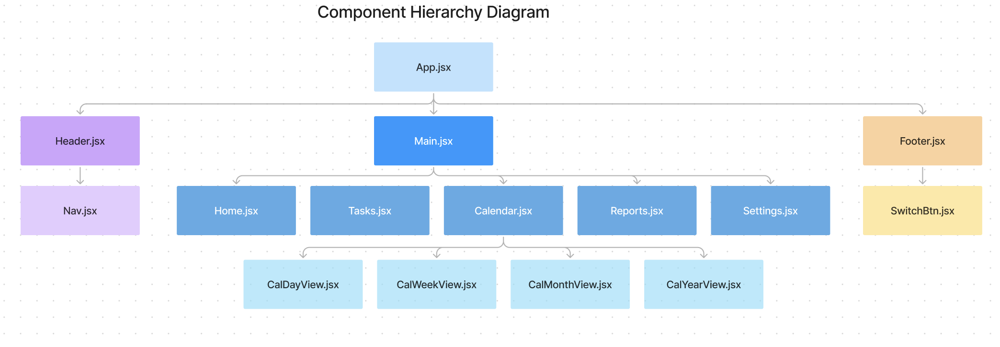

# task-manager
React and Python web-based application for scheduling tasks and receiving reminders

## Table of Contents
- [Team](#team)
- [Trello Board](#trello-board)
- [Low Fidelity Wireframes](#low-fidelity-wireframes)
- [Component Hierarchy Diagram](#component-hierarchy-diagram)
- [MVP](#mvp)
- [Stretch Goals](#stretch-goals)

## Team
- [Kyle Lugo](https://github.com/kjl56)
- [Stephanie Cancel](https://github.com/persefy)

## Trello Board
- [Task Manager Trello](https://trello.com/b/TCpZaEZJ/task-manager)

## Low Fidelity Wireframes
Tasks List, Mobile View

Menu, Mobile View

Calendar View, Mobile View

## Component Hierarchy Diagram
Version 1, below

## MVP
- Create Task list for all tasks
- Create filtered lists for Recent, Calendar, Open, and Completed
-  CRUD tasks
- Assign tasks title, duration, and optionally deadline
- Mark a task as an activity to enable the option to make active for scheduling
- If task is marked as completed, strikethrough task's title
- If task is deleted, remove from history
- If task is deactivated, remove from activities list
- Create calendar that captures days [capture each of 24 hours in time slots by 5 min increments, ET], weeks, months, years
- Display calendar by day, week, month, or year based on selection
- Generate schedule based on availability [time slots'] duration of task, and priority [based on deadline]
- Create categories (i.e, sleep)
- Assign color attribute to categories
- Enable Tasks to be assigned categories
- Create Desktop view first of app, then mobile
- Generate report of day's tasks
- Enable email notifications to alert with report of day's tasks

  
## Stretch Goals
- Enable user management
- Add login screen
- Add address to task, and optionally include travel time for duration
- Allow for time zone expansion/conversion
- Enhance prioritization algotithm to include logic for increasing "small wins" (i.e., adding smaller tasks with bigger tasks for likelihood of completion)
- generate report for day, week, month that captures at a high level completed vs not   
- Allow for multi-step tasks
- Assign level of effort layer (mentally taxing, physically taxing, entertainment, social interaction)
- Allow for rules creation (i.e., do not place more than 2 social interactions a day, etc.)
